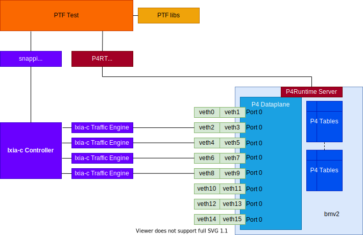
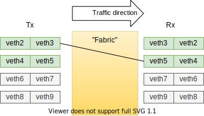
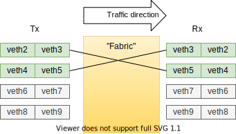
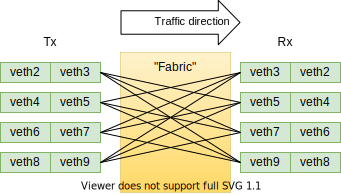

# Preface
This directory is an adaptation of [p4-guide/demo1](https://github.com/jafingerhut/p4-guide/tree/master/demo1) originally created by Andy Fingerhut. Specifically, the PTF directory contains a new test file [ptf/demo1-snappi.py](ptf/demo1-snappi.py) based on the original `demo1.py`.Instead of using [Scapy](https://scapy.readthedocs.io/en/latest/index.html) for sending and capturing packets, it has been modified to utilize 
Cisco's [T-Rex Traffic Generator](https://trex-tgn.cisco.com/) via the [snappi Python client library](https://github.com/open-traffic-generator/snappi).

`snappi` is a Python client which uses the [Open Traffic Generator](https://github.com/open-traffic-generator) API. This REST API talks to a variety of software and hardware-based traffic generators/analyzers via a unified data model, allowing you to "write tests once and run anywhere" at speeds from "slow simulations" up to Tbps.

This project comprises a simple P4 "switch" program which performs LPM Lookup on IP destination address, and switches packets to the correct egress port while performing MAC address rewrite. A few test programs in the PTF framework demonstrate the ease and power of snappi and ixia-c as replacements for Scapy.

# References
* https://github.com/open-traffic-generator
* https://pypi.org/project/snappi/
* https://github.com/jafingerhut/p4-guide
* https://github.com/p4lang/ptf
* https://scapy.readthedocs.io

# Introduction
For background context, expand the section below to see the original content of demo1/readme.md. Proceed to [System Prerequisites](#system-prerequisities) for the streamlined instructions to demo snappi and Ixia-c.

<summary>Click ""details" arrow to see the original README</summary>
<details>

See [README-using-bmv2.md](../README-using-bmv2.md) for some things
that are common across different P4 programs executed using bmv2.

This article describes how to:

+ compile a simple demo P4 program using the `p4c` P4 compiler
+ execute the compiled program using the `simple_switch` software
  switch
+ add table entries to the running P4 program using the
  `simple_switch_CLI` command line utility, and
+ send packets to the running P4 program using `scapy`.

`simple_switch_CLI` uses a control message protocol that is not the
P4Runtime API.  If you are interested in adding table entries to the
running P4 program using the P4Runtime API instead, see See
[README-p4runtime.md](README-p4runtime.md).

**Unless otherwise mentioned, steps below take place in the currect directory (the same one as contains this README).**

# Compiling

To compile the P4_16 version of the code:

    p4c --target bmv2 --arch v1model demo1.p4_16.p4
                                     ^^^^^^^^^^^^^^ source code

If you see an error message about `mark_to_drop: Passing 1 arguments
when 0 expected`, then see
[`README-troubleshooting.md`](../README-troubleshooting.md#compiler-gives-error-message-about-mark_to_drop)
for what to do.

Running that command will create these files:

    demo1.p4_16.p4i - the output of running only the preprocessor on
        the P4 source program.
    demo1.p4_16.json - the JSON file format expected by BMv2
        behavioral model `simple_switch`.

Only the file with the `.json` suffix is needed to run your P4 program
using the `simple_switch` command.  You can ignore the file with
suffix `.p4i` unless you suspect that the preprocessor is doing
something unexpected with your program.

To compile the P4_14 version of the code:

    p4c --std p4-14 --target bmv2 --arch v1model demo1.p4_14.p4
                                                 ^^^^^^^^^^^^^^ source code
        ^^^^^^^^^^^ specify P4_14 source code

The .dot and .png files in the subdirectory 'graphs' were created with
the p4c-graphs program, which is also installed when you build and
install p4c:

     p4c-graphs -I $HOME/p4c/p4include demo1.p4_16.p4

The `-I` option is only necessary if you did _not_ install the P4
compiler in your system-wide /usr/local/bin directory.


# Running

To run the behavioral model with 8 ports numbered 0 through 7:

    sudo simple_switch --log-console -i 0@veth0 -i 1@veth2 -i 2@veth4 -i 3@veth6 -i 4@veth8 -i 5@veth10 -i 6@veth12 -i 7@veth14 demo1.p4_16.json

To get the log to go to a file instead of the console:

    sudo simple_switch --log-file ss-log --log-flush -i 0@veth0 -i 1@veth2 -i 2@veth4 -i 3@veth6 -i 4@veth8 -i 5@veth10 -i 6@veth12 -i 7@veth14 demo1.p4_16.json

CHECK THIS: If you see "Add port operation failed" messages in the
output of the simple_switch command, it means that one or more of the
virtual Ethernet interfaces veth0, veth2, etc. have not been created
on your system.  Search for "veth" in the file
[`README-using-bmv2.md`](../README-using-bmv2.md) (top level
directory of this repository) for a command to create them.

See the file
[`README-troubleshooting.md`](../README-troubleshooting.md) in case
you run into troubles.  It describes symptoms of some problems, and
things you can do to resolve them.

To run CLI for controlling and examining simple_switch's table
contents:

    simple_switch_CLI

General syntax for table_add commands at simple_switch_CLI prompt:

    RuntimeCmd: help table_add
    Add entry to a match table: table_add <table name> <action name> <match fields> => <action parameters> [priority]

You can find more comprehensive documentation about the `table_add`
and `table_set_default` commands
[here](https://github.com/p4lang/behavioral-model/blob/master/docs/runtime_CLI.md#table_add)
and
[here](https://github.com/p4lang/behavioral-model/blob/master/docs/runtime_CLI.md#table_set_default),
but you do not need to know all of that to understand and use the
example commands here.

----------------------------------------------------------------------
demo1.p4_16.p4 only
----------------------------------------------------------------------

The `table_set_default` commands without the `ingressImpl.` and
`egressImpl.` prefixes before `my_drop` used to work for the P4_16
version of this program, but starting some time around June 2019 this
is no longer the case.

    table_set_default ipv4_da_lpm ingressImpl.my_drop
    table_set_default mac_da ingressImpl.my_drop
    table_set_default send_frame egressImpl.my_drop

----------------------------------------------------------------------
demo1.p4_14.p4 only
----------------------------------------------------------------------

    table_set_default ipv4_da_lpm my_drop
    table_set_default mac_da my_drop
    table_set_default send_frame my_drop

----------------------------------------------------------------------
demo1.p4_14.p4 or demo1.p4_16.p4 (same commands work for both)
----------------------------------------------------------------------

    table_add ipv4_da_lpm set_l2ptr 10.1.0.1/32 => 58
    table_add mac_da set_bd_dmac_intf 58 => 9 02:13:57:ab:cd:ef 2
    table_add send_frame rewrite_mac 9 => 00:11:22:33:44:55

Another set of table entries to forward packets to a different output
interface:

    # Version with dotted decimal IPv4 address and : separators inside
    # of hexadecimal Ethernet addresses.
    table_add ipv4_da_lpm set_l2ptr 10.1.0.200/32 => 81
    table_add mac_da set_bd_dmac_intf 81 => 15 08:de:ad:be:ef:00 4
    table_add send_frame rewrite_mac 15 => ca:fe:ba:be:d0:0d

    # Version with hex values instead of the above versions.
    # Note: the prefix length after the / character must be decimal.
    # I tried 0x20 and simple_switch_CLI raised an exception and
    # exited.
    table_add ipv4_da_lpm set_l2ptr 0x0a0100c8/32 => 0x51
    table_add mac_da set_bd_dmac_intf 0x51 => 0xf 0x08deadbeef00 0x4
    table_add send_frame rewrite_mac 0xf => 0xcafebabed00d

You can examine the existing entries in a table with 'table_dump':

    table_dump ipv4_da_lpm
    ==========
    TABLE ENTRIES
    **********
    Dumping entry 0x0
    Match key:
    * ipv4.dstAddr        : LPM       0a010001/32
    Action entry: ingressImpl.set_l2ptr - 3a
    **********
    Dumping entry 0x1
    Match key:
    * ipv4.dstAddr        : LPM       0a0100c8/32
    Action entry: ingressImpl.set_l2ptr - 51
    ==========
    Dumping default entry
    Action entry: ingressImpl.my_drop - 
    ==========


The numbers on the "Dumping entry <number>" lines are 'table entry
handle ids'.  The table API implementation allocates a unique handle
id when adding a new entry, and you must provide that value to delete
the table entry.  The handle id is unique per entry, as long as the
entry remains in the table.  After removing an entry, its handle id
may be reused for a future entry added to the table.

Handle ids are _not_ unique across all tables.  Only the pair
<table,handle_id> is unique.


----------------------------------------------------------------------
scapy session for sending packets
----------------------------------------------------------------------
Any process that you want to have permission to send and receive
packets on Ethernet interfaces (such as the veth virtual interfaces)
must run as the super-user root, hence the use of `sudo`:

```bash
$ sudo scapy
```

```python
fwd_pkt1=Ether() / IP(dst='10.1.0.1') / TCP(sport=5793, dport=80)
drop_pkt1=Ether() / IP(dst='10.1.0.34') / TCP(sport=5793, dport=80)

# Send packet at layer2, specifying interface
sendp(fwd_pkt1, iface="veth0")
sendp(drop_pkt1, iface="veth0")

fwd_pkt2=Ether() / IP(dst='10.1.0.1') / TCP(sport=5793, dport=80) / Raw('The quick brown fox jumped over the lazy dog.')
sendp(fwd_pkt2, iface="veth0")
```

----------------------------------------


# Patterns

The example table entries and sample packet given above can be
generalized to the following pattern.

If you send an input packet like this, specified as Python code when
using the Scapy library:

    input port: anything
    Ether() / IP(dst=<hdr.ipv4.dstAddr>, ttl=<ttl>)

and you create the following table entries:

    table_add ipv4_da_lpm set_l2ptr <hdr.ipv4.dstAddr>/32 => <l2ptr>
    table_add mac_da set_bd_dmac_intf <l2ptr> => <out_bd> <dmac> <out_intf>
    table_add send_frame rewrite_mac <out_bd> => <smac>

then the P4 program should produce an output packet like the one
below, matching the input packet in every way except, except for the
fields explicitly mentioned:

    output port: <out_intf>
    Ether(src=<smac>, dst=<dmac>) / IP(dst=<hdr.ipv4.dstAddr>, ttl=<ttl>-1)


----------------------------------------

# Last successfully tested with these software versions

For https://github.com/p4lang/p4c

```
$ git log -n 1 | head -n 3
commit 474ea783d2adf41c1b424e04cb0dc1981ce4b124
Author: Mihai Budiu <mbudiu@vmware.com>
Date:   Wed Oct 9 17:59:46 2019 -0700
```

For https://github.com/p4lang/behavioral-model

```
$ git log -n 1 | head -n 3
commit 33e221fd879c1aa2f16b04ab0adbf341619003ae
Author: Antonin Bas <abas@vmware.com>
Date:   Fri Sep 20 08:55:10 2019 -0700
```
</details>


# System Prerequisites
This was tested using Ubuntu 20.04. Earlier versions of Ubuntu will probably work with some adaptation, but these probably install Python 2.7 by default so some adjustments might be necessary. This is beyond the scope of this tutorial.

Two workflows are presented:
* Start with fresh Ubuntu and add quite a few baseline P4 tutorial development packages, then add *this* repo, Ixia-c + snappi. This option allows takes a few hours longer to install and build numerous packages like `gRPC`, `p4c`, etc. but it lets you customize your base OS more to your liking.
* Start with a pre-configured Ubuntu 20.04 VM already containing P4 dev packages + tutorials, then add *this* repo, Ixia-c + snappi. This avoids installig and building many tools but the base OS is a somewhat limited instance of Ubuntu 20.04 including low-resolution graphics drivers, lack of many common packages etc.

## A note on CPU Core Pinning
Due to the DPDK implementation, Ixia-c requires 2 "pinned" CPU cores for each traffic engine to achieve full performance, plus one more core dedicated as the controller. The PTF tests in this tutorial require 5 and 7 cores, respectively.

Please check the CPU core count of your development machine or VM. Try `nproc`.

## OS Option 1 - Start with Fresh Ubuntu 20.04
### Install this repo
Prepare your Ubuntu 20.04 environment. We used VirtualBox to install an Ubuntu 20.04 ISO image. Allocate at least 4GB memory and 4 CPU cores if possible.
```
git clone <this repo>
```
It will create a directory `p4-guide` where all of the subsequent activities will occur.
### Install P4 Development Dependencies
Run Andy's P4 dev environment installer. This can take up to a few hours.
```
cd p4-guide/bin
./install-p4dev-v4.sh # For Ubuntu >= 20.04 only
```
## OS Option 2 - Start with P4 Tutorial VM
Download the virtual appliance from https://drive.google.com/file/d/13SwWBEnApknu84fG9otwbL5NC78tut-d/view
Note, this image was kindly provided by Andy Fingerhut and we cannot guarantee it will always be available.

Import this appliance into your virtual machine manager, e.g. VirtualBox. Detailed instructions are beyond the scope of this tutorial.

It's advisable to increase the VM's memory to at least 4GB and allocate at least 4 CPU cores.
### Install this repo
```
git clone <this repo>
```
It will create a directory `p4-guide` where all of the subsequent activities will occur.

## Common Install Directions
These are performed after completing either one of the OS options above.

### Install snappi Python libraries
This install snappi and other libraries so `root` can access it in the PTF scripts (which have to run as `root`)
```
sudo pip3 install snappi==0.4.21 dpkt
```
You can use `snappi` in other projects! Just add `import snappi` to your Python programs.
### Optional - Install snappi-trex Documentation/Examples
`cd` to a suitable directory to install these resources for use outside this tutorial.
```
git clone --recursive https://github.com/open-traffic-generator/snappi-trex
```
# Lets do the Demos!
> **NOTE:** Unless otherwise mentioned, steps below take place in the current directory (the same one as contains this README), e.g. `p4-guide/demo1-snappi`.

## Download and set up T-Rex v2.90
Note: (This will uninstall scapy and install a custom version of scapy)
```
sudo ./trex_setup.sh
```

## Install T-Rex Scapy package
The Packet Testing Framework runs with scapy imported. This conflicts with the T-Rex scapy library, so instead, you can manually install the T-Rex scapy package using the `scapy_replace.sh` script.
```
sudo ./scapy_replace.sh
```
When finished running the PTF tests, you can restore scapy back to the original version using
```
sudo ./scapy_restore.sh
```

## Compile P4 code
```
./compile.sh
```
 OR:
```
p4c -v --target bmv2 --arch v1model --p4runtime-files demo1.p4_16.p4rt.txt demo1.p4_16.p4
```
Here's the typical output:
```
running cc -E -C -undef -nostdinc -x assembler-with-cpp -I /usr/local/share/p4c/p4include -o ./demo1.p4_16.p4i demo1.p4_16.p4
running /usr/local/bin/p4c-bm2-ss -I /usr/local/share/p4c/p4include --p4v=16 --p4runtime-files demo1.p4_16.p4rt.txt -o ./demo1.p4_16.json ./demo1.p4_16.p4i --arch v1model
```
## Create veth interfaces
```
sudo ../bin/veth_setup.sh
```
## Launch demo1 program in bmv2
```
./run_switch.sh
```
OR
```
sudo simple_switch_grpc --log-file ss-log --log-flush -i 0@veth0 -i 1@veth2 -i 2@veth4 -i 3@veth6 -i 4@veth8 -i 5@veth10 -i 6@veth12 -i 7@veth14 --no-p4
```

# Launch T-Rex in a new terminal window
Note: (Ctrl+C to quit the program)
```
sudo ./run_trex.sh
```

## Optional - Monitor traffic on veths
In four separate console windows:
```
sudo tcpdump -eni veth2
sudo tcpdump -eni veth4
sudo tcpdump -eni veth6
sudo tcpdump -eni veth8
```
## PTF Tests Overview

### How to Run

The `runptf.sh` helper script, without further arguments, will run all tests. Use `sudo` to acquire root access. This script will launch the required Ixia-c containers, run the actual PTF script, then kill the containers.

>**NOTE:** The Ixia-c traffic engines are bound to `veth3`, `veth5`, `veth7`, and `veth9` which are normally considered the "switch's" half of the veth pairs. You can observe the traffic by monitoring the other half of each pair, e.g. `veth2,4,6,8`. You cannot directly monitor the ports which are bound to Ixia-c traffic engines due to the underlying implementation.

To run a specific test, add `basename.classname` to the command, where `basename` is the base filename containing the PTF test (e.g. demo1-snappi.py is the filename, `demo1-snappi` is the basename) and `classname` is the Python classname containing the test (e.g. `SnappiFwdTestBidirLpmRange`).

Here's an example: `sudo ./runptf.sh demo1-snappi.SnappiFwdTestBidirLpmRange`

### Highlighted Tests
There a several tests inside [demo1-snappi.py](demo1-snappi.py) which you can inspect and run. Here we call out some in particular.
* [SnappiFwdTestJson](#run-snappifwdtestjson-ptf-test) - this test sends one packet between ports. This is almost identical to the original test of the same name, but modified to use snappi instead of Scapy. This test is notewrothy  in that it uses a JSON file, instead of inline Python, to perform the Ixia-c configuration to manipulate snappi objects.
* [SnappiFwdTest](#run-snappifwdtest-ptf-test) - same as [SnappiFwdTestJson](#run-snappifwdtest-ptf-test) but uses inline Python to manipulate snappi objects.
* [SnappiFwdTestBidirLpmRange](#run-snappifwdtestbidirlpmrange-ptf-test) - tests bidirectional LPM forwarding between 2 ports, verify stats and full packet contents
* [SnappiFwdTest4PortMesh](#run-snappifwdtest4portmesh-ptf-test) - tests bidirectional LPM forwarding between 2 ports, verify stats only.

Please look at the code and also read [snappi snippets](#snappi-snippets) section below.

### Test Configuration

## Run All PTF tests
```
sudo ./runptf.sh
```

## Run SnappiFwdTestJson PTF Test
This test sends unidirectional traffic between two switch ports, then verifies packet forwarding/MAC rewrite using transmit/receive packet byte-by-byte comparison.
This test is unique among all the tests because it uses a JSON configuration file [demo1-snappi-packet-config.json](demo1-snappi-packet-config.json) instead of programmatic configuration. Snappi can work either way.




### Test outline
<summary>Click the arrow to expand</summary>
<details>

* Configure Ixia-c for one traffic flow, into `veth2` and out `veth4` respectively (dataplane ports 1 and 2 in the P4 code). The flow will send a single packet with IP and MAC addresses designed to forward from dataplane port 1 to port 2.
* Configure Ixia-c to capture all the return traffic
* Start the traffic flow and capture the results
* Verify no packets were captured because the P4 dataplane forwawrding tables have not been programmed: the default action is `drop`.
* Configure the P4 tables to match on the DIP as configured in the traffic flow and forward to the correct egress ports also performing MAC rewrite.
* Start traffic flow a second time and capture everything. We wait until the received packet counts match the expected values on all flows (or timeout waiting).
* Verify the captured results has the correct number of packets for each flow.
* Perform a byte-by-byte comparison of the received packets, against the expected packets. The expected packets are modified version of th esent packets, with MAC rewrite in accordance with the intended switch behavior. We ignore portions of the packet during compare as follows:
  * The second half of the [Ixia "instrumentation" header](#about-ixia-header-and-flow-instrumentation) which follows the TCP header (since the contents vary)
  * The TCP checksum (due to the variable instrumentation contents)
  * The IP checksum (due to the variable instrumentation contents)
</details>


### Run the Test
```
sudo ./runptf.sh demo1-snappi.SnappiFwdTestJson
```

## Run SnappiFwdTest PTF Test
This test is identical to [SnappiFwdTestJson](#run-snappifwdtest-ptf-test) but uses inline Python to manipulate snappi objects.

## Run SnappiFwdTestBidirLpmRange PTF test
This test sends bidirectional traffic between two switch ports, then verifies packet forwarding/MAC rewrite using both captured statistics and transmit/receive packet byte-by-byte comparison.




### Test outline
<summary>Click the arrow to expand</summary>
<details>

* Configure Ixia-c for two traffic flows, into `veth2` and `veth4`respectively (dataplane ports 1 and 2 in the P4 code). Each flow will send 512 packets into its port, incrementing the last byte of the DIP from 0 to 256 twice. For packets 257-512, the next highest digit of the DIP is incremented, which rolls into the next `/24` prefix and therefore should not get forwarded.
* Configure Ixia-c to capture all the return traffic
* Start the traffic flows and capture the results
* Verify no packets were captured because the P4 dataplane forwawrding tables have not been programmed: the default action is `drop`.
* Configure the P4 tables to match on the DIPs as configured in the traffic flows and forward to the correct egress ports, also performing MAC rewrite.
* Start traffic flow a second time and capture everything. We wait until the received packet counts match the expected values on all flows (or timeout waiting).
* Verify the captured results has the correct number of packets for each flow.
* Perform a byte-by-byte comparison of the received packets, against the expected packets. The expected packets are modified version of th esent packets, with MAC rewrite in accordance with the intended switch behavior. We ignore portions of the packet during compare as follows:
  * The second half of the [Ixia "instrumentation" header](#about-ixia-header-and-flow-instrumentation) which follows the TCP header (since the contents vary)
  * The TCP checksum (due to the variable instrumentation contents)
  * The IP checksum (due to the variable instrumentation contents)
</details>

## Run SnappiFwdTest4PortMesh PTF test
This test sends 12 flows in a full mesh between 4 ports and verfies the received packet counts are correct. No detailed packet comparisons are performed; instead we rely upon flow-tracking statistics using the [Ixia "instrumentation" header](#about-ixia-header-and-flow-instrumentation). This is a very powerful built-in feature and is essentially the same magic which powers full-line-rate HW-based packet testers.



### Test outline
<summary>Click the arrow to expand</summary>
<details>

* Configure Ixia-c for 12 traffic flows, into `veth2`, `veth4`, `veth6` and `veth8` (dataplane ports 1-4 respectively in the P4 code). The 12 flows comprise a full-mesh, full-duplex test of port forwarding. Each flow will send 256 packets into its port, incrementing the last byte of the DIP from 1 to 256. Each flow will emit packets at 50 packets per second. We wait until the pipeline finishes processing all packets (or timeout while waiting).
* Configure Ixia-c to capture all the return traffic
* Start the traffic flows and capture the results
* Verify no packets were captured because the P4 dataplane forwarding tables have not been programmed: the default action is `drop`.
* Configure the P4 tables to match on the DIPs as configured in the traffic flows and forward to the correct egress ports, also performing MAC rewrite.
* Start traffic flow a second time and capture everything. We wait until the received packet counts match the expected values on all flows (or timeout waiting).
* Verify a number of expectations:
  * Each port transmits the correct count of packets ( 3*255, i.e. 255 packets to each of the other ports in the mesh)
  * Port Tx stats = port Rx stats = 3*255
  * The captured results has the correct number of packets for each flow (same as transmitted to each flow)
  * Examine each captured packet, extract IP src and dest address, and confirm exactly one packet was sent between each "host" and each of 255 "destinations" on the other port's subnets.
</details>

### Run the Test
```
sudo ./runptf.sh demo1-snappi.SnappiFwdTestBidirLpmRange
```

# snappi snippets
Here we'd like to showcase some code snippets which typify some of the "idioms" of snappi.

## Get an api "handle"
The handle is a client stub which connects to the Ixia-c Controller REST server.
```
self.api = snappi.api(location='https://localhost:8080')
```
Note: older versions of snappi use `host` parameter instead of `location`
## Load a JSON config file
The `config` object is used to manipulate Ixia-c configurations. You can create it a command at a time, or initialize it from a JSON file as shown below.
```
self.cfg = utils.common.load_test_config(
    self.api, 'demo1-snappi-packet-config.json', apply_settings=True
)
res = self.api.set_config(self.cfg)
```

## Create a `config` object from scratch
In contrast to the previous example, here we'll obtain the object handle for an empty `config` object (maintained by the api object), and configure it a step at a time.
```
self.cfg = self.api.config()
port1, port2 = (
    self.cfg.ports
    .port(name='port1', location='localhost:5555')
    .port(name='port2', location='localhost:5556')
)
...<more config commands>...
```
## A note about SnappiIter objects
Many collection-type object classses in snappi are derived from `SnappiIter`. Examples include Ports, Flows etc. Manipulating these objects requires an understanding of Python iterators. For example:
```
flow1 = self.cfg.flows.flow(name='f1')[-1]
```
This line of code instantiates a new `Flow` object named `f1` and appends it to the `Flows` collection.
`self.cfg.flows` is a collection. Then `.flow()` is a factory methdo which creates a new `Flow` and appends it to `Flows`.

When you create a flow, the return value, e.g. from `self.cfg.flows.flow(name='f1')`, is an iterator to the `Flows` collection. To get back the `Flow` just created, use the `[-1]` accessor to get the last item in the collection.

Another idiom you may see in `snappi` examples is:
```
flow1, = self.cfg.flows.flow(name='f1')
```
The result on the right side of the `=` is an iterator as we explained above. To get the first item in the collection and assign to `flow1`, assign the iterator result to a list of variables consisting of `flow1` and a trailing commas,which means "discard remaining list values."

Another idiom you may encounter is:
```
flow1, flow2 = self.cfg.flows.flow(name='f1').flow(name='f2')
```
This creates the first flow `f1` using `self.cfg.flows.flow(name='f1')`. The return of this factory methodd is the iterator, to which we append another flow via `.flow(.name='f2')`. The left side `flow1,flow2 =` assigns the two list members returned by the iterator to two variables.

Another idiomatic example:
```
self.cfg.flows.flow(name='f2')
flow2 = self.cfg.flows[1] # access with index
```
This appends a new flow to the `Flows` collection, then accesses it via a list index.

## Define many flows with auto-increment header fields
This snippet defines a full mesh of flows between 4 ports. Some of the constants are defined elsewhere (see [ptf/demo1-snappi.py](ptf/demo1-snappi.py) for details).

```
for src in self.port_ndxs:
    for dst in self.port_ndxs:
        if src == dst:
            continue # no hairpin switching i.e. port doesn't send to itself
        flow = self.cfg.flows.flow(name='f%d' %i)[-1]
        # flow endpoints
        flow.tx_rx.port.tx_name = ports[src].name
        flow.tx_rx.port.rx_name = ports[dst].name
        # configure rate, size, frame count
        flow.size.fixed = 100
        flow.rate.pps = 50
        flow.duration.fixed_packets.packets = tx_count
        # configure protocol headers with defaults fields
        flow.packet.ethernet().ipv4().tcp()

        eth = flow.packet[0]
        eth.src.value = host_macs[src]
        eth.dst.value = host_macs[dst]

        ipv4 = flow.packet[1]
        ipv4.dst.increment.start = ip_hosts[dst]
        ipv4.dst.increment.step = '0.0.0.1'
        ipv4.dst.increment.count = tx_count
        ipv4.src.value = ip_hosts[src]
        ipv4.time_to_live.value = 64

        tcp = flow.packet[2]
        tcp.src_port.value = 1234
        tcp.dst_port.value = 80
```
Interesting parts of this snippet include:

Create a flow of `tx_count` packets of length 100, send at 50 PPS.
```
        flow.size.fixed = 100
        flow.rate.pps = 50
        flow.duration.fixed_packets.packets = tx_count
```

Get the second layer (IPv4 header), assign the DIP an initial value then auto-increment the least significant digit of the DIP (to exercise a `/24` subnet).
```
        ipv4 = flow.packet[1]
        ipv4.dst.increment.start = ip_hosts[dst]
        ipv4.dst.increment.step = '0.0.0.1'
        ipv4.dst.increment.count = tx_count
```


## Start traffic, Capture and wait for results
This snippet starts a capture, then starts traffic flows.
```
SnappiPtfUtils.start_capture(self.api, [capture_port_name])
SnappiPtfUtils.start_traffic(self.api)
```
The part which follows waits until all flows have stopped and stats have settled, or quits after a timeout:
```
# define storage for comparing stats in wait_for()
self.prev_stats = {}
utils.wait_for(
    lambda: stats_settled(self.api, self.cfg, self.prev_stats), 'stats to settle',
    interval_seconds=2, timeout_seconds=20
)
```
The most interesting part is the callback function invoked via `lambda` above:
```
def stats_settled(api, cfg, prev_stats):
    """ Returns true if all tx flows are stopped and stats have "settled."
        Settled means current tx/rx packet counts == previous counts.
        Call this after you've stopped your flows.
        Expecially useful in cases where the dataplane takes a while to process all the packets
        you've already sent and you want to analyze final, stable values.
        api - the snappi API handle
        cfg - the configuration objects (not used currently)
        prev_stats - caller-allocated storage for previous stats sample; initialize
                     with {} prior to calling in wait_for() lambda loop
    """
    port_results, flow_results = utils.get_all_stats(api, print_output=False)

    if 'port' not in prev_stats:
        prev_stats['port'] = None
    prev_port_results = prev_stats['port']
    if 'flow' not in prev_stats:
        prev_stats['flow'] = None
    prev_flow_results = prev_stats['flow']
    
    result = all([f.transmit == 'stopped' for f in flow_results])
    if not result:
        print ("Waiting for flows to stop...")
    else:
        if not (prev_port_results and prev_flow_results):
             result = False # Need to get first results to have a "previous"
        else:
            # compare curr with prev
            for stat in port_results:
                prev_stat = [item for item in prev_port_results if item.name == stat.name]
                if prev_stat is None:
                    result = False # Previous has less items than current, i.e. it was incomplete
                    break
                prev_stat = prev_stat[0]
                if stat.frames_tx != prev_stat.frames_tx:
                    result = False # tx not settled yet
                    break
                if stat.frames_rx != prev_stat.frames_rx:
                    result = False # rx not settled yet
                    break
        
    # store in caller's "prev_stats" dict
    prev_stats['port'] = port_results
    prev_stats['flow'] = flow_results
    return result
```
The `utils.wait_for()` helper method will keep calling `stats_settled()` every `interval_seconds` until it returns `True` or it exceeds `timeout_seconds`.

`stats_settled()` detects that all flows have stopped transmitting, and that the statistics counters have stopped changing in between samples. This gives time for the P4 bmv2 pipeline, which is relatively slow, to process all the packets before doing our final test assertions. This is an example of synchronizing the script state to the device under test.

You can find a similar function called `stats_expected()` in the code. It uses different criteria for the final test results (sum of all Rx flow counters == sum of all Tx flow counters).

